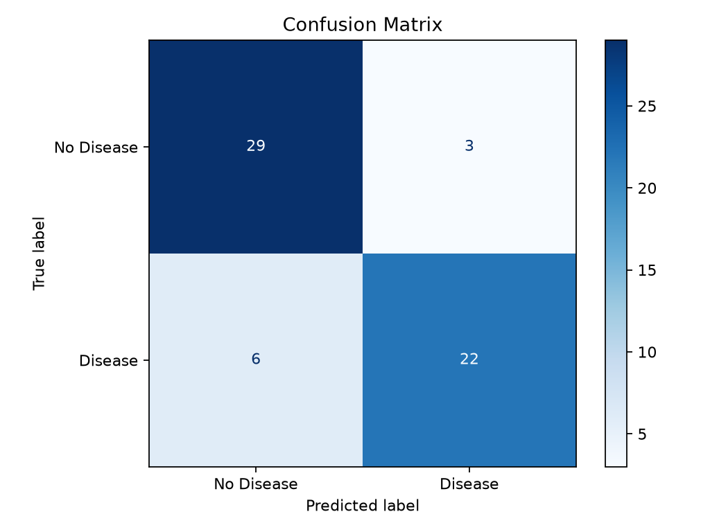
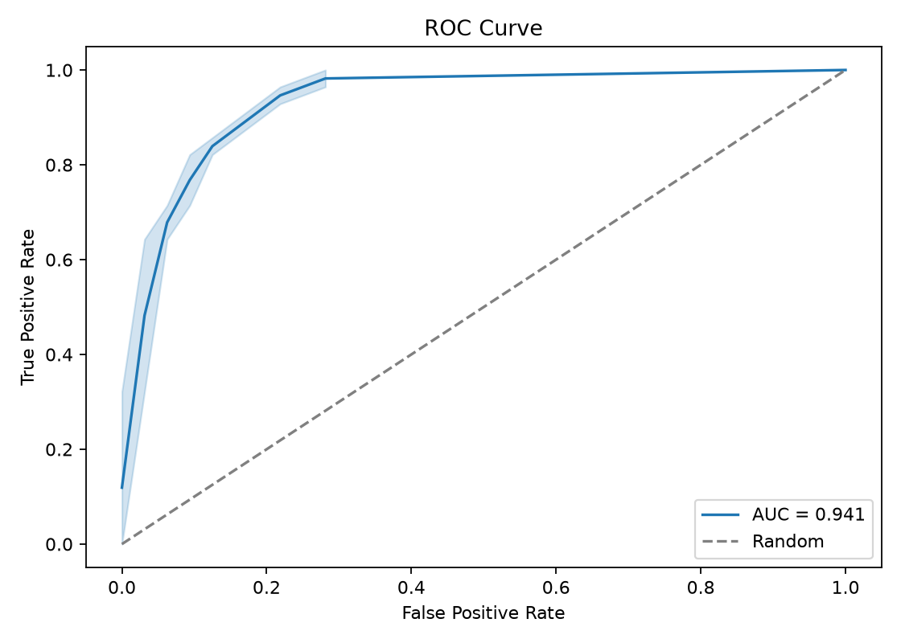

# End-to-End MLOps Pipeline for Heart Disease Prediction

Student Name: Kachhadiya Ravi  
BITS ID: 2024ac05707
Course: ML Ops, AIMLCZG523  
Repository: https://github.com/rkdgr8/ML-Ops

## 1. Project Overview

This project implements an end-to-end MLOps workflow for predicting heart disease
risk using the UCI Heart Disease dataset. The objective is to build a
reproducible machine learning solution that covers data acquisition,
preprocessing, model training, experiment tracking, API serving, testing,
containerization, and deployment readiness.

The model predicts whether a patient is likely to have heart disease based on
clinical attributes such as age, resting blood pressure, cholesterol, maximum
heart rate, exercise-induced angina, ST depression, number of major vessels, and
thalassemia category.

## 2. Dataset

Dataset used: UCI Heart Disease dataset, Cleveland processed data.

The dataset contains 14 columns:

| Column | Description |
| --- | --- |
| `age` | Patient age |
| `sex` | Patient sex |
| `cp` | Chest pain type |
| `trestbps` | Resting blood pressure |
| `chol` | Serum cholesterol |
| `fbs` | Fasting blood sugar indicator |
| `restecg` | Resting ECG result |
| `thalach` | Maximum heart rate achieved |
| `exang` | Exercise-induced angina |
| `oldpeak` | ST depression induced by exercise |
| `slope` | Slope of peak exercise ST segment |
| `ca` | Number of major vessels |
| `thal` | Thalassemia category |
| `target` | Heart disease diagnosis |

The original target values were converted into a binary classification target:

| Value | Meaning |
| --- | --- |
| 0 | No heart disease |
| 1 | Heart disease present |

Missing values represented by `?` were converted to null values and removed from
the cleaned training dataset.

## 3. Data Acquisition and Preprocessing

The data pipeline is implemented in `src/data_processing.py`.

The pipeline performs the following actions:

- downloads the Cleveland dataset from the UCI repository
- assigns meaningful column names
- converts `?` values into missing values
- converts `ca` and `thal` into numeric columns
- drops rows containing missing values
- converts the original multi-class target into binary classification
- saves the cleaned dataset to `data/processed/heart_processed.csv`

Command used:

```bash
python -m src.data_processing
```

## 4. Exploratory Data Analysis

The EDA workflow is implemented in `src/eda.py`.

Planned EDA outputs:

- class distribution plot
- numeric feature histograms
- correlation heatmap
- missing value analysis
- age versus maximum heart rate relationship

Command used:

```bash
python -m src.eda
```

EDA screenshot placeholders:

```text
screenshots/eda/class_distribution.png
screenshots/eda/feature_histograms.png
screenshots/eda/correlation_heatmap.png
screenshots/eda/missing_values.png
screenshots/eda/age_vs_thalach.png
```

TODO: Add generated EDA screenshots after running the EDA script.

## 5. Model Development

The training workflow is implemented in `src/train.py`.

Two classification models were trained and compared:

- Logistic Regression
- Random Forest

The preprocessing and model were packaged together using a Scikit-learn
`Pipeline`. The preprocessing stage uses:

- `StandardScaler` for numeric features
- `OneHotEncoder` for categorical features
- `ColumnTransformer` to combine both preprocessing branches

Hyperparameter tuning was performed using `GridSearchCV` with five-fold
cross-validation and ROC-AUC as the optimization metric.

Command used:

```bash
python -m src.train
```

## 6. Model Evaluation

The best model selected was:

```text
logistic_regression
```

Model comparison:

| Model | CV ROC-AUC Mean | Accuracy | Precision | Recall | F1 | Test ROC-AUC |
| --- | ---: | ---: | ---: | ---: | ---: | ---: |
| Logistic Regression | 0.9052 | 0.8500 | 0.8800 | 0.7857 | 0.8302 | 0.9408 |
| Random Forest | 0.9004 | 0.8500 | 0.8519 | 0.8214 | 0.8364 | 0.9319 |

The final saved model artifact is:

```text
models/heart_disease_pipeline.joblib
```

Model evaluation artifacts:





## 7. Experiment Tracking with MLflow

MLflow was integrated into the training workflow to track experiments,
parameters, metrics, and model artifacts.

Experiment name:

```text
heart-disease-classification
```

For each model run, the following are logged:

- model name
- best hyperparameters
- cross-validation ROC-AUC mean and standard deviation
- test accuracy
- test precision
- test recall
- test F1-score
- test ROC-AUC
- trained model artifact
- confusion matrix and ROC curve for the best model
- metrics JSON artifact

Command to start MLflow UI:

```bash
mlflow ui
```

MLflow UI URL:

```text
http://127.0.0.1:5000
```

TODO: Add MLflow UI screenshot after running the MLflow UI.

## 8. API Serving

The prediction API is implemented using FastAPI in `api/main.py`.

Available endpoints:

| Endpoint | Method | Purpose |
| --- | --- | --- |
| `/health` | GET | Health check |
| `/predict` | POST | Predict heart disease risk |
| `/docs` | GET | Swagger UI |

The `/predict` endpoint accepts patient attributes as JSON and returns:

- binary prediction
- confidence score
- diagnosis label

Example request:

```bash
curl -X POST http://127.0.0.1:8000/predict \
  -H "Content-Type: application/json" \
  -d "{\"age\":67,\"sex\":1,\"cp\":4,\"trestbps\":160,\"chol\":286,\"fbs\":0,\"restecg\":2,\"thalach\":108,\"exang\":1,\"oldpeak\":1.5,\"slope\":2,\"ca\":3,\"thal\":3}"
```

Example response:

```json
{
  "prediction": 1,
  "confidence": 0.8964416521576047,
  "diagnosis": "heart disease risk"
}
```

TODO: Add Swagger UI/API test screenshot.

## 9. Testing

Unit tests were added for:

- data cleaning
- EDA summary generation
- preprocessing pipeline construction
- training helper functions
- MLflow logging orchestration
- API health check
- API prediction response contract

Test command:

```bash
pytest
```

Docker-based test command:

```bash
docker run --rm -v "D:\BITS\courses\sem3\MLOps\Assigment:/app" -w /app heart-disease-api pytest
```

## 10. Containerization

The API is containerized using Docker.

Build command:

```bash
docker build -t heart-disease-api .
```

Run command:

```bash
docker run --rm -p 8000:8000 heart-disease-api
```

The container exposes the FastAPI service on port `8000`.

TODO: Add Docker build/run screenshot.

## 11. CI/CD

A GitHub Actions workflow is defined in `.github/workflows/ci.yml`.

The workflow performs:

- repository checkout
- Python setup
- dependency installation
- linting with Ruff
- unit testing with Pytest
- Docker image build validation

TODO: Add GitHub Actions screenshot after CI runs successfully.

## 12. Deployment

Kubernetes manifests are provided in the `k8s/` directory:

```text
k8s/deployment.yaml
k8s/service.yaml
```

The deployment manifest runs the API container, and the service manifest exposes
it through a load balancer style service.

TODO: Add deployment screenshot after running in Minikube or Docker Desktop
Kubernetes.

## 13. Monitoring and Logging

Current monitoring support includes:

- API health check endpoint
- prediction request validation through FastAPI/Pydantic
- container logs through Docker

Planned monitoring additions:

- structured API request logging
- Prometheus-compatible metrics endpoint
- optional Grafana dashboard screenshot

## 14. Conclusion

This project demonstrates a practical MLOps workflow for a binary classification
problem. The solution includes reproducible data preparation, model training,
experiment tracking, model packaging, API serving, Docker containerization,
tests, and deployment manifests.

The Logistic Regression model achieved the best ROC-AUC score on the test set
and was selected as the final production model.

## 15. Appendix

Repository:

```text
https://github.com/rkdgr8/ML-Ops
```

Important commands:

```bash
python -m src.data_processing
python -m src.eda
python -m src.train
uvicorn api.main:app --host 127.0.0.1 --port 8000
docker build -t heart-disease-api .
docker run --rm -p 8000:8000 heart-disease-api
pytest
```
